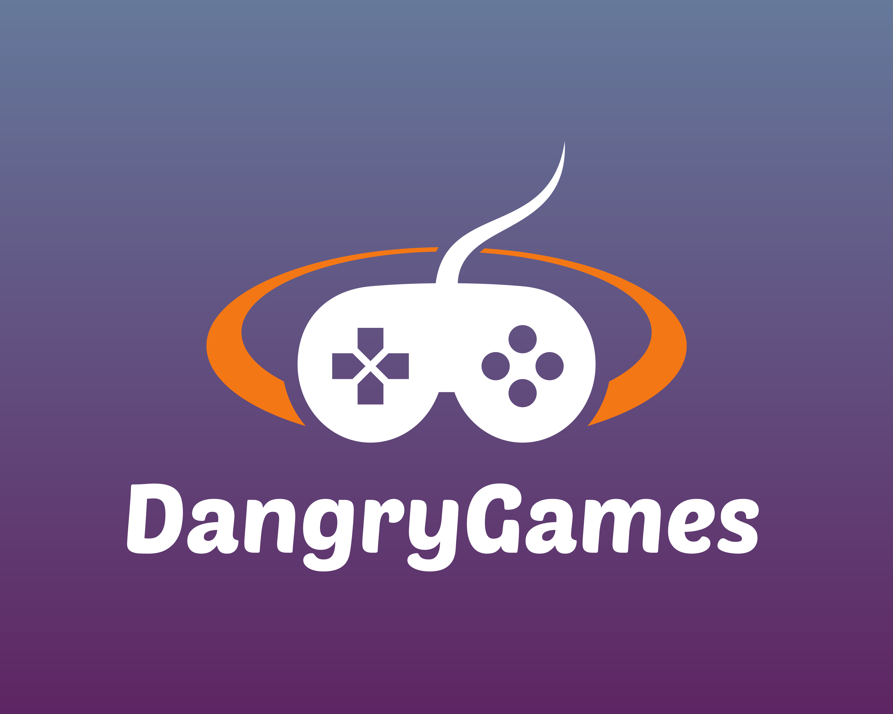

### Hi there and welcome to my GitHub page 👋

I am a gameplay programmer at Halfbrick Studios. Recently released Age of Zombies, TapKO, Colossatron Cosmis Crisis, and Magic Brick Wars for both iOS and Android devices.

---
### Main language

---
### Platforms

---
### Software

